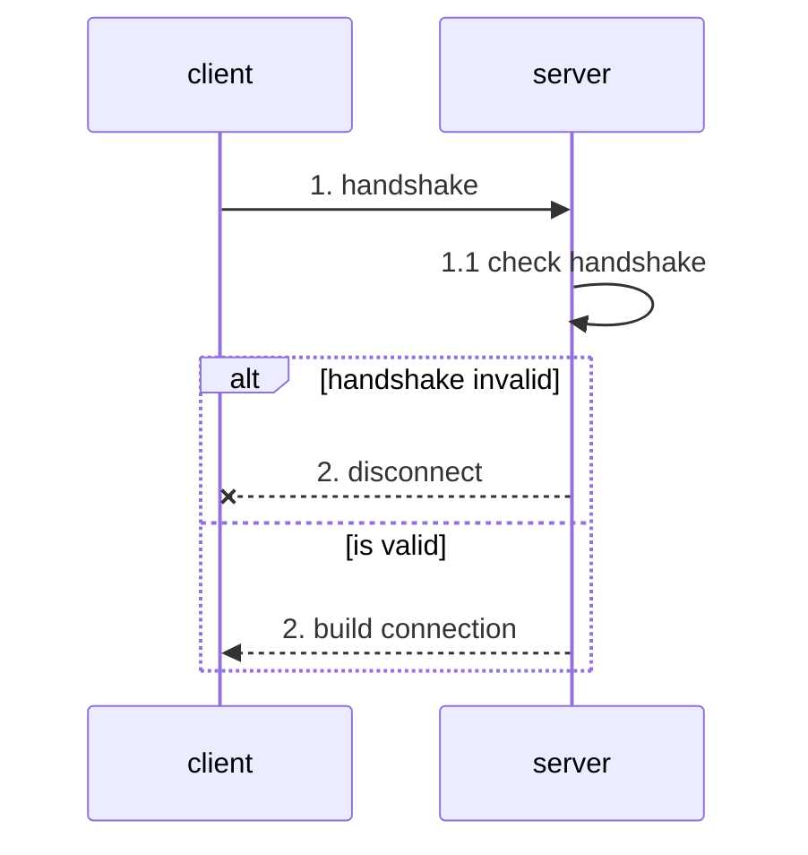
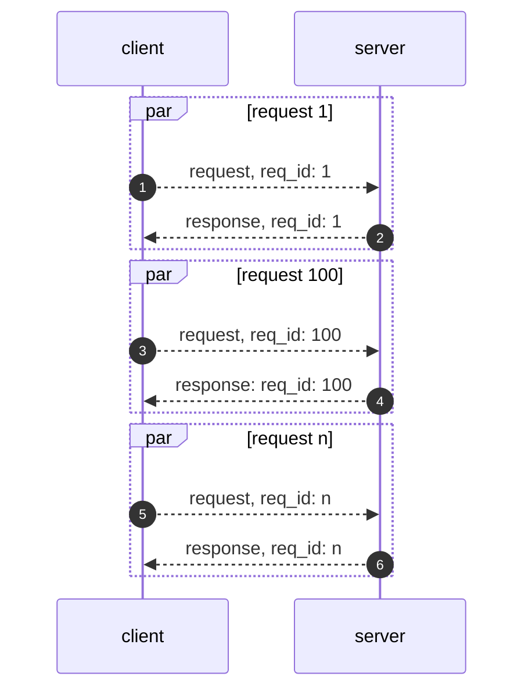
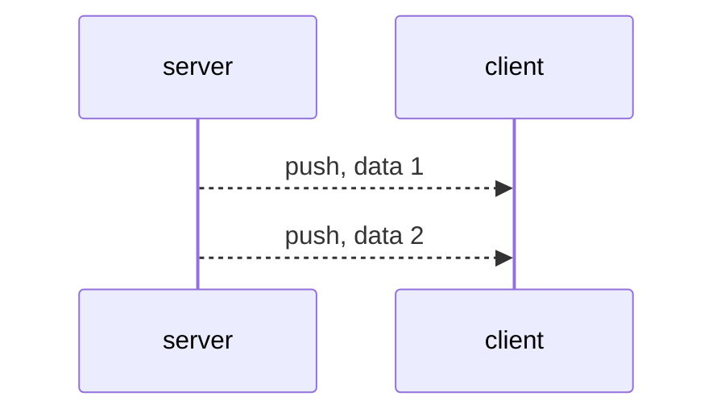

客户端在和服务端交互时，会有三种数据包类型：

- 握手 - 建立连接
- 请求 - 客户端向服务端发起请求
- 响应 - 服务端向客户端响应请求
- 推送 - 服务端向客户端推送数据

## 握手

客户端向服务端发送握手包后，链接就建立了，服务端会判断握手包是否合法，不合法则发送一个错误包，并且断开底层连接。如果链接的是 TCP 服务端可以同时发送握手包和第一个数据包。

## 请求与响应

协议支持，`请求 <--> 响应` 的通信方式，即客户端发送一个请求，服务端返回一个响应。

客户端和服务端握手成功后，双方就可以进行 `请求 <--> 响应` 的通信，请求和响应通过请求 `id` 进行关联。

## 推送

推送是一端向另一端直接推送数据而不需要另一端响应。

> 目前仅存在服务端向客户端推送数据的场景。

