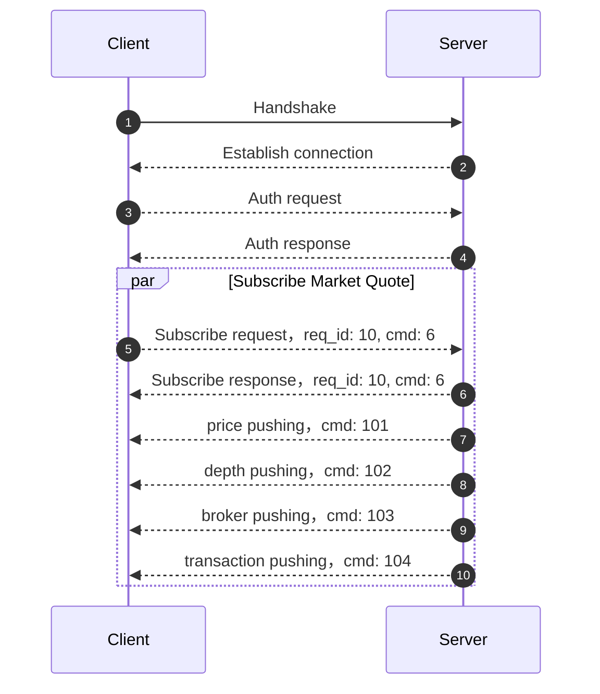

:::success NOTE
Our OpenAPI SDK has fully implemented the function of subscribing to quotes, and you can use the SDK directly.

https://open.longbridge.com/sdk

The documentation in this chapter provides API details for your reference.
:::

Client can access market quote feed by `WebSocket` and `TCP`. After client subscribing stock quote, quote gateway can push real-time quote data to client.

:::info
WebSocket Endpoint: `wss://openapi-quote.longportapp.com`

TCP Endpoint: `openapi-quote.longportapp.com:2020`
:::

Flow：



## Subscribe

Client can subscribe different quote type through subscribe commmand.

Subscribe command [protobuf defination](../quote/subscribe/subscribe)

Example:

```json
{
  "symbol": ["700.HK", "AAPL.US"]
  "sub_type": [1, 2]
  "is_first_push": true
}

```

> Here is `JSON` for easy showing case, actually need using protobuf encoding.

Client can also check quote topics already subscribing, [protobuf defination](../quote/subscribe/subscription).

After client success subscribing quote, server will push real-time quote data to client, data [protobuf defination](../quote/overview).

## Other Quote APIs

All quote all should be fetched by our quote gateway, more details can be found in [quote overview](../quote/overview).

## Feed Protocol

If you want subscribe quote data from socket, you must know more details of our [protocol](./protocol/overview)
