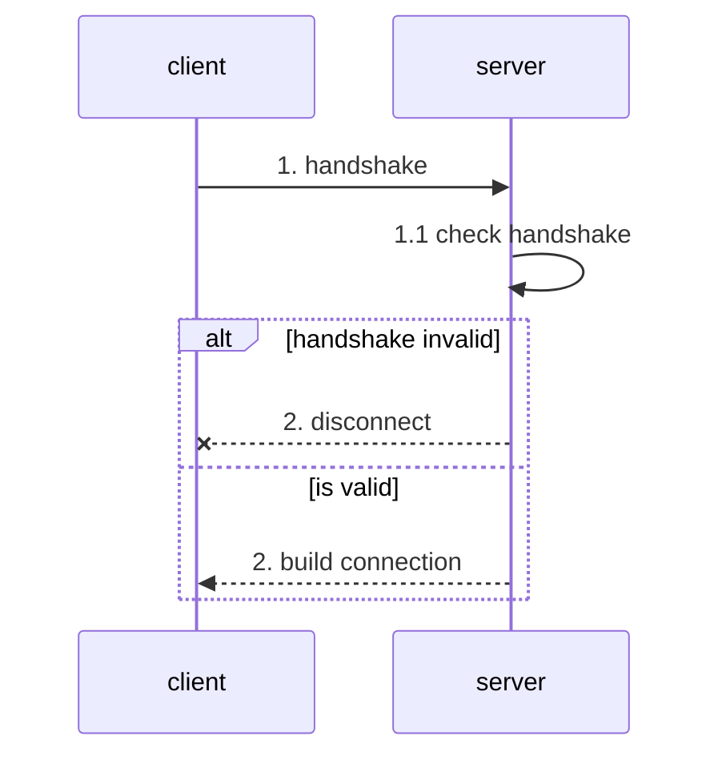
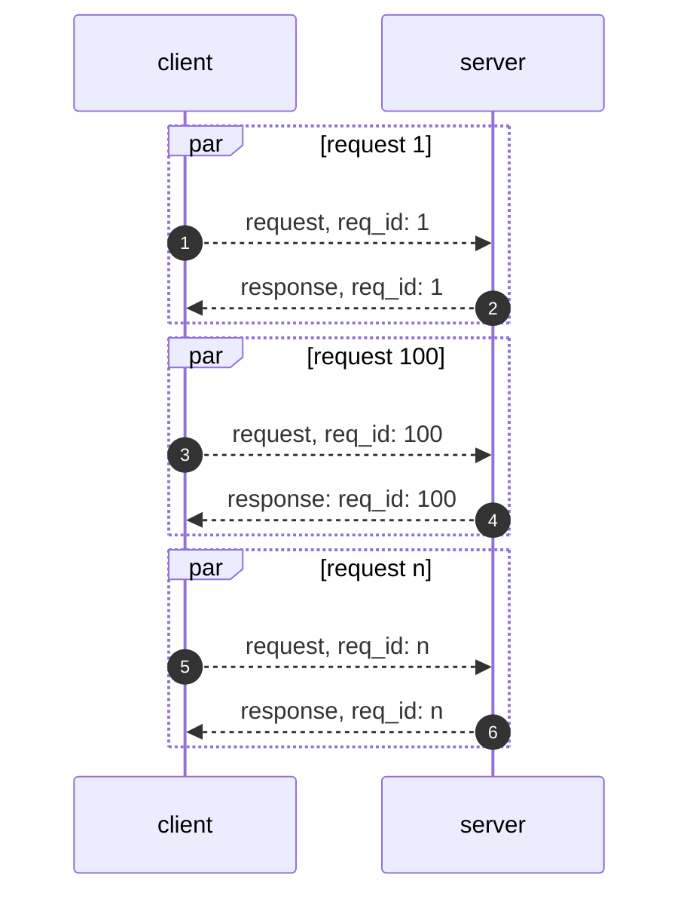
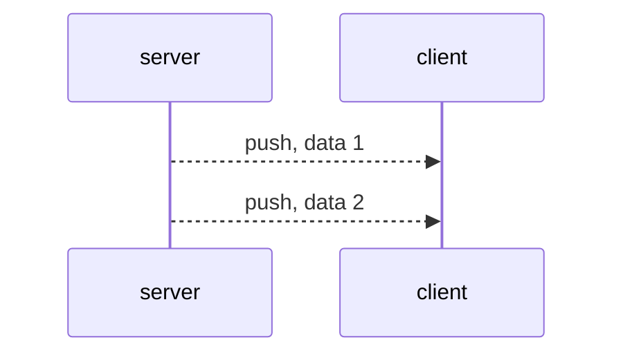

There are three type packet will client and server send to each other:

- handshake - start establish connection
- request - client send request to server
- response - server send response to client
- push - server push real-time data to client

## Handshake

Flow:

After client sending handshake packet server, the connection has been established. If handshake packet is invalid, server will push a close data to client. If access by `TCP`, client can send handshake packet and first data packet(auth) for accelerating communication.

## Request and Response

`Request <--> Response`: Client send a request packet, server will send back a response packet.

Flow:

After client and server sucess handshaking, peers can use `Request <--> Response` to communicate. `Request` and `Response` are paired by `request_id`.

> Client and Server can send heartbeat request to each other.

## Push

Push is one peer send data to another peer, and no need response.

> Right now, we only support server push data to client.
