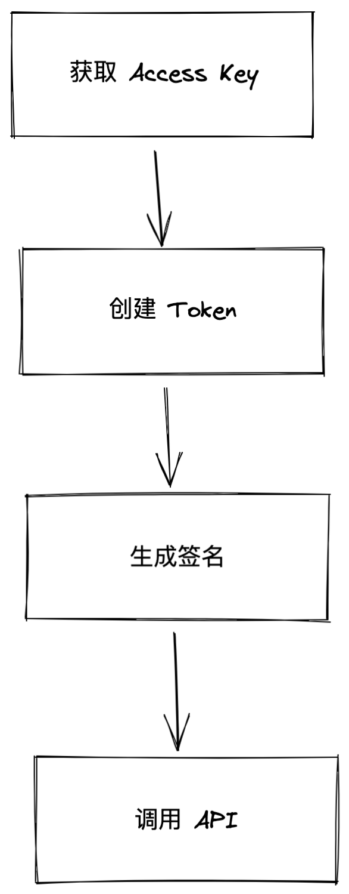

## API 调用流程

下图是 API 调用流程： 



### 1. 获取 Access Key 

首先要申请 Access Key 拿到 Access Secret， 并设置相应权限。获取 Access Key 与申请权限请参考 [链接]。

### 2. 创建 Token 

在开发者后台中创建 Token。详见【链接】。

### 3. 生成签名 

先根据相应的 API 文档构造请求后， 通过 openapi sdk【链接】直接调用 API，sdk 会帮助生成签名， 或者根据授权与签名文档中的算法自己生成签名, 并设置相应的请求参数。

### 4. 调用 API 

使用 http 客户端发送签名过后的请求。

## API 调用方式

调用服务端接口需要是用 HTTPS 协议，JSON 格式，并是用 UTF-8 编码。

示例如下：

```bash
curl -v http://127.0.0.1:8080/v1/test -H "X-Api-Signature: {签名}" -H "X-Api-Key: {access key}" -H "authorization: {token}" -H "X-Timestamp: {签名时间}"
```

## API 响应结果说明

所有 API 相应体结构都包括 code, message, data 三个部分。code 是业务码，message 是错误信息，data 是请求结果。
请求成功时 code 为 0，http status 为 200，当请求失败时 code 不为 0，并且 http status 不为 200。

例如：
```
http code: 200
http body: {
  "code": 0,
  "msg": "success"
}

```
```
http code: 403 
http body: {
  "code": 403201,
  "msg": "signature invalid"
}
```

