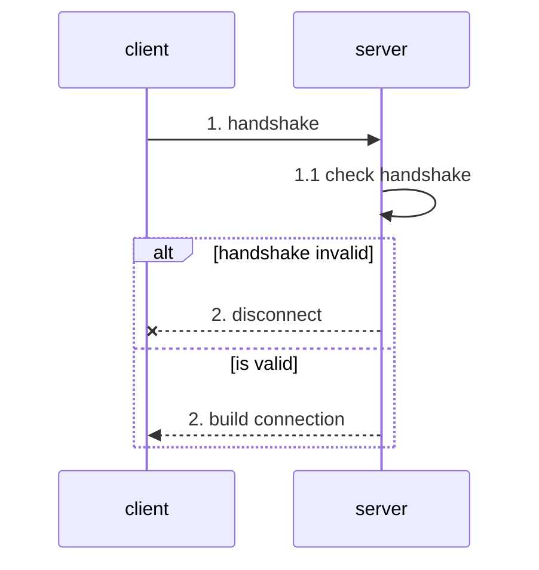
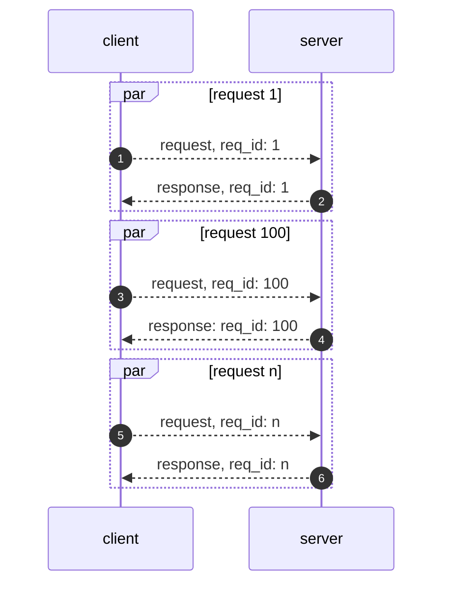
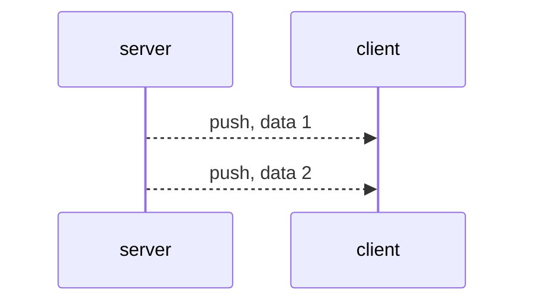
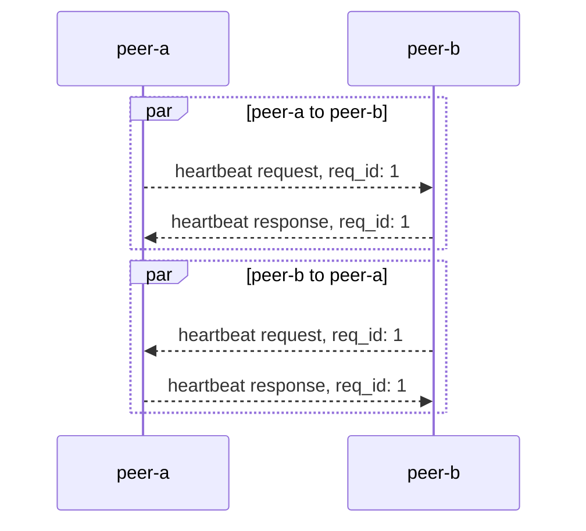
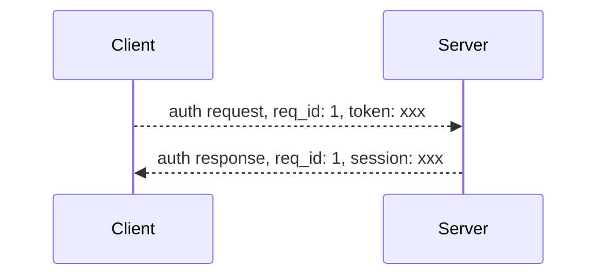

该协议主要用于 `TCP` 和 `WebSocket` 通信时使用。

[字节序](https://zh.wikipedia.org/wiki/%E5%AD%97%E8%8A%82%E5%BA%8F)使用 BigEndian。

# 一、协议

## 1.1 通信过程

### 1.1.1 握手



客户端向服务端发送握手包后，链接就建立了，服务端会判断握手包是否合法，不合法则发送一个错误包，并且断开底层连接。如果链接的是 TCP 服务端可以同时发送握手包和第一个数据包。

### 1.1.2 请求与响应

协议支持，`请求 <--> 响应` 的通信方式，即客户端发送一个请求，服务端返回一个响应。



客户端和服务端握手成功后，双方就可以进行 `请求 <--> 响应` 的通信，请求和响应通过请求 `id` 进行关联。

### 1.1.3 推送

推送是一端向另一端直接推送数据而不需要另一端响应。

> 目前仅存在服务端向客户端推送数据的场景。



## 1.2 协议结构

### 1.2.1 握手

握手由客户端发送至服务端，共 2 个字节，用于协商协议版本和一些连接的元数据。

> 通过 WebSocket 进行连接时，握手信息通过 URL Query 进行传递

#### 1.2.1.1 结构

```
 0 1 2 3 4 5 6 7
+-+-+-+-+-+-+-+-+
|  ver  | codec |
+-+-+-+-+-+-+-+-+
|platfo.|reserve|
+-+-+-+-+-+-+-+-+
```

| 字段     | 长度 (bit) | 说明                          |
| -------- | ---------- | ----------------------------- |
| ver      | 4          | 协议版本，目前仅 `1` 一个版本 |
| codec    | 4          | Body 序列化类型：1 - protobuf |
| platform | 4          | 0b1001 - openapi              |
| reserve  | 4          | 预留，当前为 0b0000           |

#### 1.2.1.2 例子

- ver - 0b0001
- codec - 0b0001
- platform - 0b1001
- reserve - 0b0000

两个字节的内容：

```
0b00010001,
0b00001001
```

### 1.2.2 数据包

我们将数据包分成两个部分：

- 包头 - 固定大小 1 个字节，用于描述包体承载的信息
- 包体 - 数据内容

我们的包体是可变长的，长度由包头决定

#### 1.2.2.1 包头

包头长度 1 个字节，结构如下：

```
 0 1 2 3 4 5 6 7
+-+-+-+-+-+-+-+-+
|  type |v|g|re.|
+-+-+-+-+-+-+-+-+
```

| 字段    | 长度 (bit) | 说明                                                            |
| ------- | ---------- | --------------------------------------------------------------- |
| type    | 4          | `1` - request<br/>`2` - resopnse<br/>`3` - push                 |
| verify  | 1          | 数据是否加签标志<br/><br/>`0` - 不加签<br/>`1` - 加签           |
| gzip    | 1          | 数据是否使用 `gzip` 压缩: <br/><br/>`1` - 压缩<br/>`0` - 不压缩 |
| reserve | 2          | 预留                                                            |

例子

```
// reserve - 0, gzip - 0, verify - 0,  type - 1
0b 0000 0001

// reserve - 0, gzip - 1, verify - 0, type - 2
0b 0011 0010

// reserve - 0, gzip - 1, verify - 1, type - 3
0b 0001 0011


//  reserve - 3, gzip - 1, verify - 0, type - 3
0b 1110 0011
```

#### 1.2.2.3 请求包

请求本身的长度是可变的，由 `body` 长度和是否加签决定

```
  0                   1                   2                   3
 0 1 2 3 4 5 6 7 8 9 0 1 2 3 4 5 6 7 8 9 0 1 2 3 4 5 6 7 8 9 0 1
+-+-+-+-+-+-+-+-+-+-+-+-+-+-+-+-+-+-+-+-+-+-+-+-+-+-+-+-+-+-+-+-+
|  type |v|g|re.|    cmd_code   |           request_id          |
+-+-+-+-+-+-+-+-+-+-+-+-+-+-+-+-+-+-+-+-+-+-+-+-+-+-+-+-+-+-+-+-+
|                               |            timeout            |
+-+-+-+-+-+-+-+-+-+-+-+-+-+-+-+-+-+-+-+-+-+-+-+-+-+-+-+-+-+-+-+-+
|                    body_len                   |               |
+-+-+-+-+-+-+-+-+-+-+-+-+-+-+-+-+-+-+-+-+-+-+-+-+               +
|                       body(by body_len)                       |
+-+-+-+-+-+-+-+-+-+-+-+-+-+-+-+-+-+-+-+-+-+-+-+-+-+-+-+-+-+-+-+-+
|                                                               |
+                        nonce(optional)                        +
|                                                               |
+-+-+-+-+-+-+-+-+-+-+-+-+-+-+-+-+-+-+-+-+-+-+-+-+-+-+-+-+-+-+-+-+
|                                                               |
+                                                               +
|                                                               |
+                      signature(optional)                      +
|                                                               |
+                                                               +
|                                                               |
+-+-+-+-+-+-+-+-+-+-+-+-+-+-+-+-+-+-+-+-+-+-+-+-+-+-+-+-+-+-+-+-+

```

第一个字节为包头，包体字段说明如下：

| 字段       | 长度 (bit)                 | 长度（字节）                      | 说明                                                                                 |
| ---------- | -------------------------- | ------------------------------------- | ------------------------------------------------------------------------------------ |
| cmd_code   | 8                          | 1                                     | 指令 cmd 值                                                                          |
| request_id | 32(uint32)                 | 4                                     | 请求 id，同一个连接的 id 需要唯一，从 1 开始，到达 4294967295 后从新开始。           |
| timeout    | 16(uint16)                 | 2                                     | `timeout` 单位毫秒，最大 60000（60s）                                            |
| body_len   | 24(uint32)                 | 3                                     | `body` 长度，单位：字节，最大 16 MB 数据；如果 gzip 为 1，该值为 `body` 压缩后的长度 |
| body       | 可变长度，由 body_len 决定 | 可变长度                              | `body`，最大 16 MB                                                                   |
| nonce      | 64                         | 8                                     | 仅当包头中的 `verify` 为 1 时存在                                                    |
| signature  | 128                        | 16 ｜ 仅当包头中的 verify 为 1 时存在 |

#### 1.2.2.3 响应包

当一端收到另一端的请求时，必须回复一个响应回去，结构如下：

```
 0                   1                   2                   3
 0 1 2 3 4 5 6 7 8 9 0 1 2 3 4 5 6 7 8 9 0 1 2 3 4 5 6 7 8 9 0 1
+-+-+-+-+-+-+-+-+-+-+-+-+-+-+-+-+-+-+-+-+-+-+-+-+-+-+-+-+-+-+-+-+
|  type |v|g|re.|    cmd_code   |           request_id          |
+-+-+-+-+-+-+-+-+-+-+-+-+-+-+-+-+-+-+-+-+-+-+-+-+-+-+-+-+-+-+-+-+
|                               |  status_code  |    body_len   |
+-+-+-+-+-+-+-+-+-+-+-+-+-+-+-+-+-+-+-+-+-+-+-+-+-+-+-+-+-+-+-+-+
|            body_len           |                               |
+-+-+-+-+-+-+-+-+-+-+-+-+-+-+-+-+                               +
|                       body(by body_len)                       |
+-+-+-+-+-+-+-+-+-+-+-+-+-+-+-+-+-+-+-+-+-+-+-+-+-+-+-+-+-+-+-+-+
|                                                               |
+                        nonce(optional)                        +
|                                                               |
+-+-+-+-+-+-+-+-+-+-+-+-+-+-+-+-+-+-+-+-+-+-+-+-+-+-+-+-+-+-+-+-+
|                                                               |
+                                                               +
|                                                               |
+                      signature(optional)                      +
|                                                               |
+                                                               +
|                                                               |
+-+-+-+-+-+-+-+-+-+-+-+-+-+-+-+-+-+-+-+-+-+-+-+-+-+-+-+-+-+-+-+-+
```

字段说明：

| 字段       | 长度 (bit)                 | 长度（字节）                        | 说明                                                                               |
| ---------- | -------------------------- | ------------------------------------- | ---------------------------------------------------------------------------------- |
| cmd_code   | 8                          | 1                                     | 指令 cmd 值                                                                        |
| request_id | 32(uint32)                 | 4                                     | 请求 id，同一个连接的 id 需要唯一，从 1 开始，到达 4294967295 后从新开始。         |
| status     | 8(uint8)                   | 1                                     | 状态码 `0` - 成功；参考状态码表                                                    |
| body_len   | 24(uint32)                 | 3                                     | `body` 长度，单位：字节，最大 16 MB 数据；如果 gzip 为 1，该值为 body 压缩后的长度 |
| body       | 可变长度，由 body_len 决定 | 可变长度                              | `body`，最大 16 MB                                                                 |
| nonce      | 64                         | 8                                     | 仅当包头中的 `verify` 为 1 时存在                                                  |
| signature  | 128                        | 16 ｜ 仅当包头中的 verify 为 1 时存在 |

##### 1.2.2.3.1 响应包状态码

响应包有状态说明：

| 值  | 标识                  | 说明                                      |
| --- | --------------------- | ----------------------------------------- |
| 0   | SUCCESS               | 成功，类似于 HTTP 200                     |
| 1   | SERVER_TIMEOUT        | 服务端超时，类似于 HTTP 408               |
| 3   | BAD_REQUEST           | 请求错误，通常为参数错误，类似于 HTTP 400 |
| 5   | UNAUTHENTICATED       | 鉴权失败，类似于 HTTP 401                 |
| 7   | SERVER_INTERNAL_ERROR | 服务端内部错误，类似于 HTTP 500           |

#### 1.2.2.4 推送包

推送用于一端向另一端发送数据，接收方不需要进行回复，结构如下：

```
 0                   1                   2                   3
 0 1 2 3 4 5 6 7 8 9 0 1 2 3 4 5 6 7 8 9 0 1 2 3 4 5 6 7 8 9 0 1
+-+-+-+-+-+-+-+-+-+-+-+-+-+-+-+-+-+-+-+-+-+-+-+-+-+-+-+-+-+-+-+-+
|  type |v|g|re.|    cmd_code   |            body_len           |
+-+-+-+-+-+-+-+-+-+-+-+-+-+-+-+-+-+-+-+-+-+-+-+-+-+-+-+-+-+-+-+-+
|  body_len     |               body(by body_len)               |
+-+-+-+-+-+-+-+-+-+-+-+-+-+-+-+-+-+-+-+-+-+-+-+-+-+-+-+-+-+-+-+-+
|                                                               |
+                        nonce(optional)                        +
|                                                               |
+-+-+-+-+-+-+-+-+-+-+-+-+-+-+-+-+-+-+-+-+-+-+-+-+-+-+-+-+-+-+-+-+
|                                                               |
+                                                               +
|                                                               |
+                      signature(optional)                      +
|                                                               |
+                                                               +
|                                                               |
+-+-+-+-+-+-+-+-+-+-+-+-+-+-+-+-+-+-+-+-+-+-+-+-+-+-+-+-+-+-+-+-+
```

字段说明：


| 字段      | 长度 (bit)                 | 长度（字节）                          | 说明                                                                                 |
| --------- | -------------------------- | --------------------------------------- | ------------------------------------------------------------------------------------ |
| cmd_code  | 8                          | 1                                       | 指令 cmd 值                                                                          |
| body_len  | 24(uint32)                 | 3                                       | `body` 长度，单位：字节，最大 16 MB 数据；如果 gzip 为 1，该值为 `body` 压缩后的长度 |
| body      | 可变长度，由 body_len 决定 | 可变长度                                | `body`，最大 16 MB                                                                   |
| nonce     | 64                         | 8                                       | 仅当包头中的 `verify` 为 1 时存在                                                    |
| signature | 128                        | 16 ｜ 仅当包头中的 `verify` 为 1 时存在 |

二、指令集

## 2.1 控制指令

目前有 4 个控制指令：

| cmd_code | 说明                                                  |
| -------- | ----------------------------------------------------- |
| 0        | 关闭 - 服务端在关闭链接前会向客户端推送关闭包         |
| 1        | 心跳 - 用于保持链接                                   |
| 2        | 鉴权 - 握手成功后，如果没有 session，则需要鉴权       |
| 3        | 重连 - 链接断开后，如果有 session，用于链接合法性鉴权 |

### 2.1.1 关闭

:::info
指令：`0`
:::

服务端主动关闭链接时，会向客户端推送一个关闭包。

> 关闭包是推送类型，不需要回复

服务端主动关闭链接总共有一下几种情况：

1. 心跳超时
2. 服务端发生错误
3. 服务端关闭
4. 客户端发送数据解析失败
5. 鉴权失败
6. Session 过期
7. Session 重复建链

这些信息会放到 `body` 内发送，Protobuf 定义如下：

```protobuf
message Close {
 enum Code {
   HeartbeatTimeout  = 0; // 心跳超时
   ServerError       = 1; // 服务端错误
   ServerShutdown    = 2; // 服务端关闭
   UnpackError       = 3; // 数据截取错误
   AuthError         = 4; // 鉴权失败
   SessExpired       = 5; // session 过期
   ConnectDuplicate  = 6; // 单个 session 重复连接
  }
  Code code = 1;
  string reason = 2;
}
```

### 2.1.2 心跳

:::info
指令：`1`
:::

一端可以通过向另一端发送心情请求，根据返回来判断链接的健康状态。心跳请求包没有指定接口，一端收到心跳请求后，仅需将 `body` 原封不动的返回回去即可。

> 保持连接的同时，也可以用于检测网络延时：心跳请求时，可在发送包 `body` 添加本端当前时间戳；当收到心跳响应，解析 `body`，用当前时间戳减去解析出来的时间戳，就可以得出链路的延时



`body` 的例子：

```protobuf
message Heartbeat {
  int64 timestamp = 1;
}
```

### 2.1.3 登录鉴权

:::info
指令：`2`
:::

登陆鉴权用于校验连接的合法性，在握手建立连接以后发送的第一个包必须是登录鉴权请求或者重连请求。



> 登录鉴权的 `token` 通过 [REST 接口](./socket-otp-api.md)获取。

服务端在 token 校验成功后会给客户端返回一个 session，在 session 的有效期内，客户端可以使用 session 进行重新链接，不需要再获取 `token`。

请求和返回的定义如下：

```protobuf
message AuthRequest {
  string token = 1;
}

message AuthResponse {
  string session_id = 1;
  string expires = 3;
}
```

### 2.1.4 重连

:::info
指令：`3`
:::

重连是客户端断开链接后，通过 session 进行鉴权。和登录鉴权相似的是，服务在校验 session 过后会返回一个新的 session，下次客户端重连时可以使用。

请求和返回定义如下：

```protobuf
message ReconnectRequest {
    string session_id = 1;
}

message ReconnectResponse {
  string session_id = 1;
  string expires = 3;
}
```

## 2.2 业务指令

### 2.3 行情

[行情的业务指令](../quote/overview.md)

> 行情需要连接[行情网关](#41-行情)

### 2.4 交易

[交易的业务指令](../trade/trade-push.md)

> 交易需要连接[交易网关](#41-交易)

# 三、WebSocket 接入

相对于 TCP，WebSocket 接入有以下不同

- 在 HTTP upgrade 成 WebSocket 时进行握手，不需要另外的握手流程
- WS 的上层应用数据不是面向流的，是面向 WS frame
- 心跳直接使用 WS 协议本身的心跳机制

## 3.1 握手

WebSocket 握手通过 URL 的 query 参数就行

| 字段     | 类型 | 说明          |
| -------- | ---- | ------------- |
| version  | int  | 仅支持：1     |
| codec    | int  | 目前仅支持：1 |
| platform | int  | 写死：9       |

例子

```
wss://openapi-quote.longbridge.gobal?version=1&codec=1&platform=9
```

## 3.2 心跳

客户端和服务端进行心跳时，直接使用 WebSocket 协议自身的心跳

# 四、域名和业务

目前我们行情和交易推送网关时分开的，可以根据所在物理位置选择要链接的域名

## 4.1 行情

| 域名                                       | 协议      | 地区     |
| ------------------------------------------ | --------- | -------- |
| tcp://openapi-quote.longbridge.global:2020 | tcp       | 中国香港 |
| wss://openapi-quote.longbridge.global      | websocket | 中国香港 |

## 4.1 交易

| 域名                                       | 协议      | 地区     |
| ------------------------------------------ | --------- | -------- |
| tcp://openapi-trade.longbridge.global:2020 | tcp       | 中国香港 |
| wss://openapi-trade.longbridge.global      | websocket | 中国香港 |
