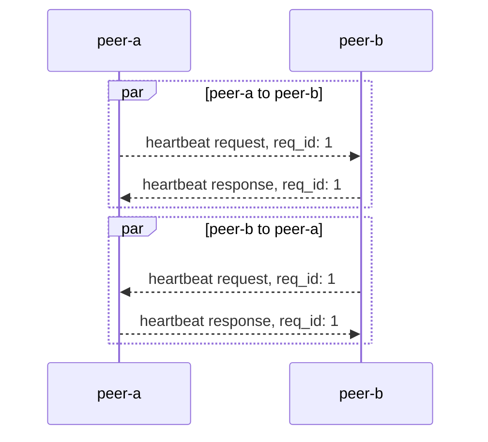
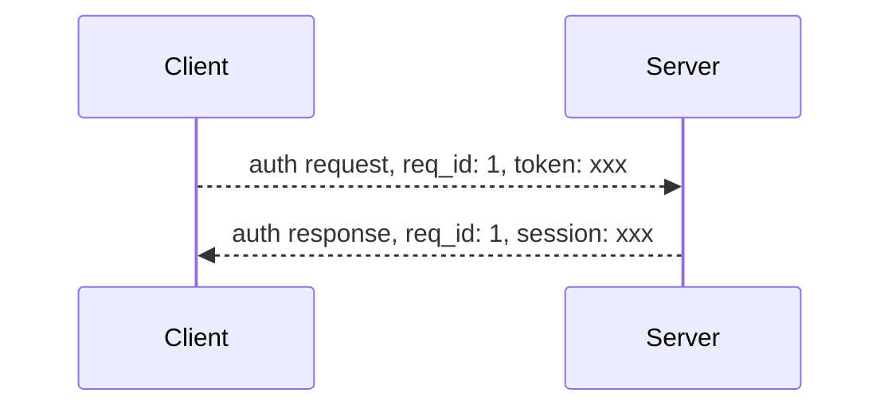

控制指令是基础指令，主要用于建立链接，保持会话使用。

目前有 4 个控制指令：

| cmd_code | 说明                                                  |
| -------- | ----------------------------------------------------- |
| 0        | 关闭 - 服务端在关闭链接前会向客户端推送关闭包         |
| 1        | 心跳 - 用于保持链接                                   |
| 2        | 鉴权 - 握手成功后，如果没有 session，则需要鉴权       |
| 3        | 重连 - 链接断开后，如果有 session，用于链接合法性鉴权 |

## 关闭

:::info
指令：`0`
:::

服务端主动关闭链接时，会向客户端推送一个关闭包。

> 关闭包是推送类型，不需要回复

服务端主动关闭链接总共有一下几种情况：

1. 心跳超时
2. 服务端发生错误
3. 服务端关闭
4. 客户端发送数据解析失败
5. 鉴权失败
6. Session 过期
7. Session 重复建链

这些信息会放到 `body` 内发送，Protobuf 定义如下：

```protobuf
message Close {
 enum Code {
   HeartbeatTimeout  = 0; // 心跳超时
   ServerError       = 1; // 服务端错误
   ServerShutdown    = 2; // 服务端关闭
   UnpackError       = 3; // 数据截取错误
   AuthError         = 4; // 鉴权失败
   SessExpired       = 5; // session 过期
   ConnectDuplicate  = 6; // 单个 session 重复连接
  }
  Code code = 1;
  string reason = 2;
}
```

## 心跳

:::info
指令：`1`
:::

一端可以通过向另一端发送心情请求，根据返回来判断链接的健康状态。心跳请求包没有指定 `body` 的结构，一端收到心跳请求后，仅需将 `body` 原封不动的返回回去即可。

> 保持连接的同时，也可以用于检测网络延时：心跳请求时，可在发送包 `body` 添加本端当前时间戳；当收到心跳响应，解析 `body`，用当前时间戳减去解析出来的时间戳，就可以得出链路的延时



`body` 的例子：

```protobuf
message Heartbeat {
  int64 timestamp = 1;
}
```

## 登录鉴权

:::info
指令：`2`
:::

登陆鉴权用于校验连接的合法性，在握手建立连接以后发送的第一个包必须是登录鉴权请求或者重连请求。



> 登录鉴权的 `token` 通过 [REST 接口](./socket-otp-api.md) 获取。

服务端在 token 校验成功后会给客户端返回一个 session，在 session 的有效期内，客户端可以使用 session 进行重新链接，不需要再获取 `token`。

请求和返回的定义如下：

```protobuf
message AuthRequest {
  string token = 1;
}

message AuthResponse {
  string session_id = 1;
  int64 expires = 2;
}
```

## 重连

:::info
指令：`3`
:::

重连是客户端断开链接后，通过 session 进行鉴权。和登录鉴权相似的是，服务在校验 session 过后会返回一个新的 session，下次客户端重连时可以使用。

请求和返回定义如下：

```protobuf
message ReconnectRequest {
    string session_id = 1;
}

message ReconnectResponse {
  string session_id = 1;
  int64 expires = 2;
}
```

## Protobuf

所有控制指令相关的 `Protobuf` 都已经开源在 [GitHub](https://github.com/longbridgeapp/openapi-protobufs/blob/main/control/control.proto)
