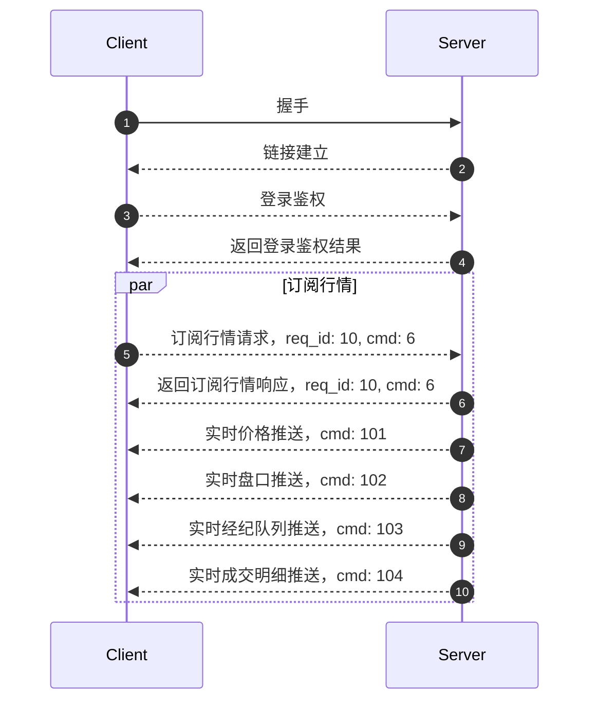

客户端可以通过 WebSocket 或者 TCP 和行情网关建立长连接，客户端订阅股票行情，行情网关会实时推送客户端订阅的实时行情。

:::info
WebSocket Endpoint: `wss://openapi-quote.longbrdge.global`

TCP Endpoint: `openapi-quote.longbridgeapp.com:2020`
:::

流程如下：



## 订阅

客户端在和服务端建立连接后需要通过订阅行情的指令订阅不同类型的行情。

订阅的 Protobuf 定义可以[查看](../quote/subscribe/subscribe)

Example:

```json
{
  "symbol": ["700.HK", "AAPL.US"]
  "sub_type": [1, 2]
  "is_first_push": true
}

```

> 这里方便展示使用 `JSON`，实际上需要通过 protobuf 序列化请求到服务端

客户端也可以通过获取已订阅接口查看自己已经订阅的标的行情，[Protobuf 定义](../quote/subscribe/subscription)

订阅成功后，服务端会推送相应的标的行情到客户端，具体的数据可以查看[行情概览](../quote/overview)

## 其他接口

行情的数据拉去都是通过长连接网关的，具体可以查看[行情概览](../quote/overview)

## 协议

想要订阅行情，必须先了解我们的协议，我们使用的长连接[协议](./protocol/overview)
