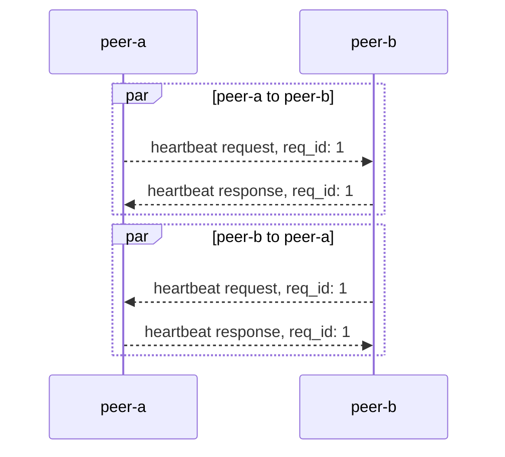
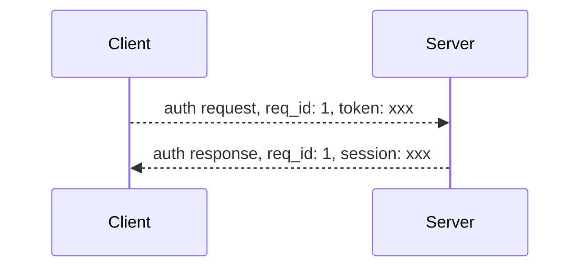

Control Commands are basic commands, using for create connection and keep connection alive.

Control Commands:

| cmd_code | description                                                                                |
| -------- | ------------------------------------------------------------------------------------------ |
| 0        | close - before server close the connection between client, server will send a close packet |
| 1        | heartbeat - keep connection alive                                                          |
| 2        | auth - auth connection                                                                     |
| 3        | reconnect - use session to auth                                                            |

## Close

:::info
Cmd：`0`
:::

Before server close the connection between client, server will send a close packet.

> close packet is push type packet, no need response

Cases server will close the connection:

1. heartbeat timeout
2. server internal error
3. server shutdown
4. client send invalid packet(can't parse by server)
5. auth failed
6. session expired when reconnect
7. duplicate connection have been created

The reason why server close the connection will send by close packet, protobuf defination:

```protobuf
message Close {
 enum Code {
   HeartbeatTimeout  = 0; // Heartbeat timeout
   ServerError       = 1; // Server internal error
   ServerShutdown    = 2; // Server shutdown
   UnpackError       = 3; // Server can't paser client packet
   AuthError         = 4; // Auth failed
   SessExpired       = 5; // Session expired
   ConnectDuplicate  = 6; // create duplicated connection
  }
  Code code = 1;
  string reason = 2;
}
```

## Heartbeat

:::info
Cmd：`1`
:::

Oner peer and send heartbeat to another peer to known health of another peer. Heartbeat do not limit body structure, one peer receive a heartbeat packet, only need send the `body` back.

> Heartbeat not only can keep connection alive, but also can detect latency of the network between two peers. One peer can set current timestamp in heartbeat body, when receive the response, use current timestamp minus timestamp in the body to get lantency of network.



Example of heartbeat `body` ：

```protobuf
message Heartbeat {
  int64 timestamp = 1;
}
```

## Auth

:::info
Cmd：`2`
:::

Client need prove connection is legal. After handshake with server, client send auth packet as first packet.



> Auth `token` can be created through [HTTP API](./socket-token-api)

After auth success, server will set session in auth response, client can use the session to reconnect and no need to request a new `token`.

Auth Request and Response protobuf:

```protobuf
message AuthRequest {
  string token = 1;
}

message AuthResponse {
  string session_id = 1;
  int64 expires = 2;
}
```

## Reconnect

:::info
Cmd：`3`
:::

After client disconnect from server, client can use session to reconnect to server when session is not expired. After reconnect success, server will set new session in reconnect response body.

Reconnect Request and Response:

```protobuf
message ReconnectRequest {
    string session_id = 1;
}

message ReconnectResponse {
  string session_id = 1;
  int64 expires = 2;
}
```

## Protobuf

All control command protobuf definations are opensource in [GitHub](https://github.com/longportapp/openapi-protobufs/blob/main/control/control.proto)
