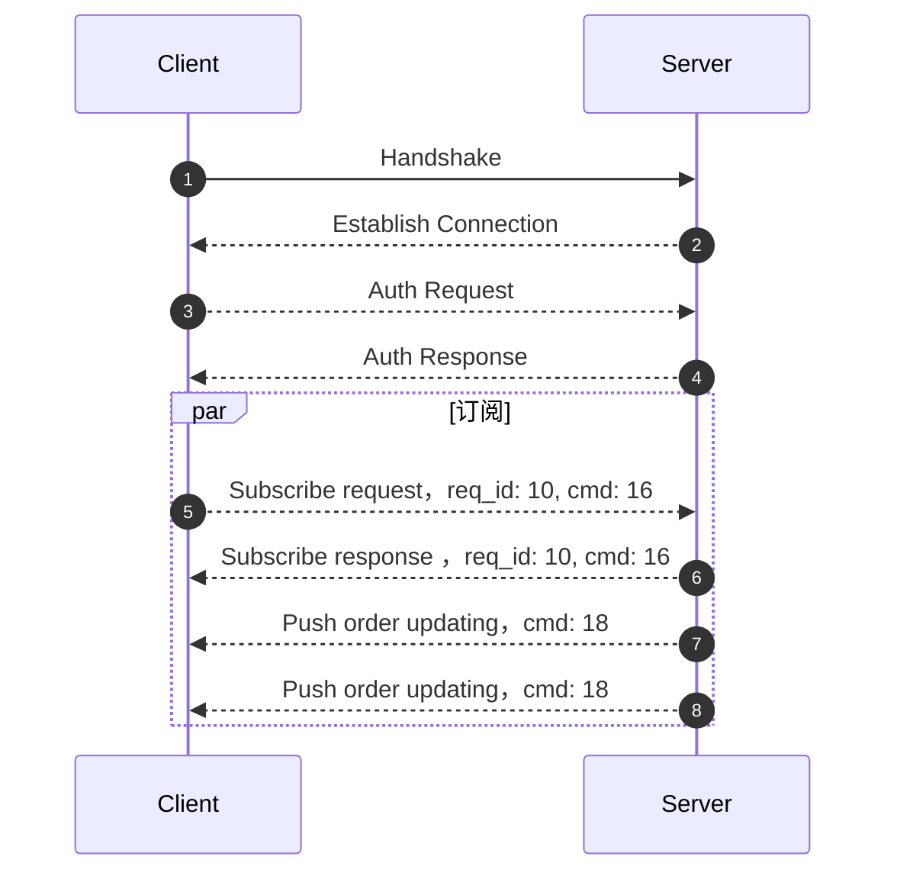

客户端可以通过 WebSocket 或者 TCP 和交易推送网关建立长连接，当订单状态更新时，客户端可以实时的接收通知。

Client can access trade feed by `WebSocket` and `TCP`. After client subscribing, trade gateway can push real-time trade changings of user.

:::info
WebSocket Endpoint: `wss://openapi-trade.longbridge.global`

TCP Endpoint: `openapi-trade.longbridge.global`
:::

Flow：



## Subscribe

Subscribe [protobuf defination](../quote/trade/trade-push)

Example:

```json
{
  "topics": ["private"]
}
```

> Here is `JSON` for easy showing case, actually need using protobuf encoding.

## Pushing Example

```json
{
  "topic": "private",
  "content_type": 2,
  "dispatch_type": 1,
  "data": "eyJldmVudCI6Im9yZGVyX2NoYW5nZWRfbGIiLCJkYXRhIjp7InNpZGUiOiJCdXkiLCJzdG9ja19uYW1lIjoi6IW+6K6v5o6n6IKhIiwicXVhbnRpdHkiOiIxMDAwIiwic3ltYm9sIjoiNzAwLkhLIiwib3JkZXJfdHlwZSI6IkxPIiwicHJpY2UiOiIyMTMuMiIsImV4ZWN1dGVkX3F1YW50aXR5IjoiMTAwMCIsImV4ZWN1dGVkX3ByaWNlIjoiMjEzLjIiLCJvcmRlcl9pZCI6IjI3IiwiY3VycmVuY3kiOiJIS0QiLCJzdGF0dXMiOiJOZXdTdGF0dXMiLCJzdWJtaXR0ZWRfYXQiOiIxNTYyNzYxODkzIiwidXBkYXRlZF9hdCI6IjE1NjI3NjE4OTMiLCJ0cmlnZ2VyX3ByaWNlIjoiMjEzLjAiLCJtc2ciOiJJbnN1ZmZpY2llbnQgUXR5IC0gMTAwMCIsInRhZyI6IkdUQyIsInRyaWdnZXJfc3RhdHVzIjoiQUNUSVZFIiwidHJpZ2dlcl9hdCI6IjE1NjI3NjE4OTMiLCJ0YWlsaW5nX2Ftb3VudCI6IjUiLCJ0YWlsaW5nX3BlcmNlbnQiOiIxIiwibGltaXRfb2Zmc2V0IjoiMC4wMSIsImFjY291bnRfbm8iOiJISzEyMzQ0NSJ9fQ=="
}
```

:::info
`data` is binary(base64) content of `JSON` string
:::

The real `JSON` format of `data`:

```json
{
  "event": "order_changed_lb",
  "data": {
    "side": "Buy",
    "stock_name": "Tecent",
    "quantity": "1000",
    "symbol": "700.HK",
    "order_type": "LO",
    "price": "213.2",
    "executed_quantity": "1000",
    "executed_price": "213.2",
    "order_id": "27",
    "currency": "HKD",
    "status": "NewStatus",
    "submitted_at": "1562761893",
    "updated_at": "1562761893",
    "trigger_price": "213.0",
    "msg": "Insufficient Qty - 1000",
    "tag": "GTC",
    "trigger_status": "ACTIVE",
    "trigger_at": "1562761893",
    "tailing_amount": "5",
    "tailing_percent": "1",
    "limit_offset": "0.01",
    "account_no": "HK123445"
  }
}
```

Field description is [here](../trade/trade-definition#websocket-push-notification)

## Feed Protocol

If you want subscribe trading data from socket, you must know more details of our [protocol](../protocol/overview)

## 协议
