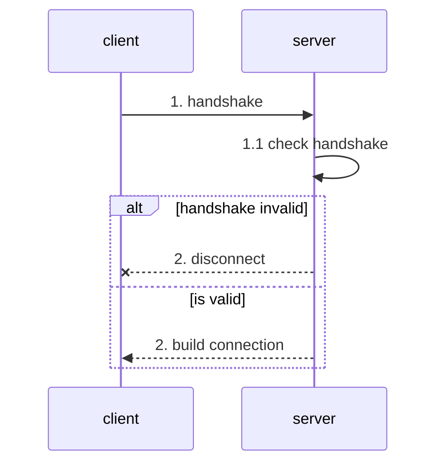
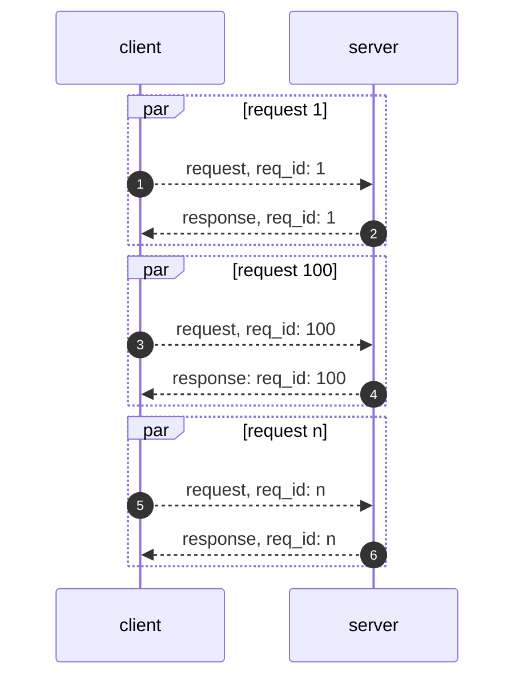
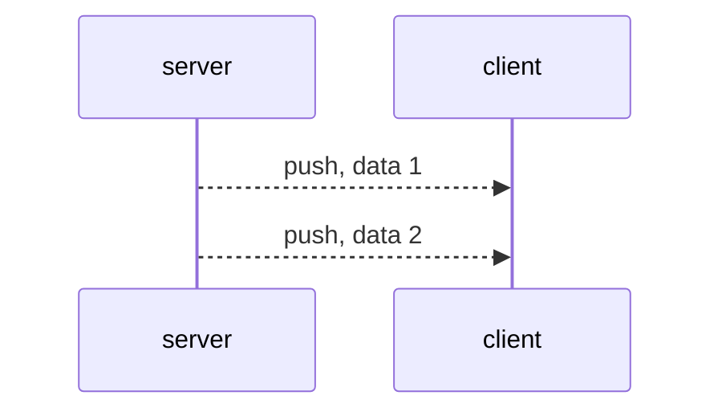

客戶端在和服務端交互時，會有三種數據包類型：

- 握手 - 建立連接
- 請求 - 客戶端向服務端發起請求
- 響應 - 服務端向客戶端響應請求
- 推送 - 服務端向客戶端推送數據

## 握手

客戶端向服務端發送握手包後，鏈接就建立了，服務端會判斷握手包是否合法，不合法則發送一個錯誤包，並且斷開底層連接。如果鏈接的是 TCP 服務端可以同時發送握手包和第一個數據包。

## 請求與響應

協議支持，`請求 <--> 響應` 的通信方式，即客戶端發送一個請求，服務端返回一個響應。

客戶端和服務端握手成功後，雙方就可以進行 `請求 <--> 響應` 的通信，請求和響應通過請求 `id` 進行關聯。

## 推送

推送是一端向另一端直接推送數據而不需要另一端響應。

> 目前僅存在服務端向客戶端推送數據的場景。

