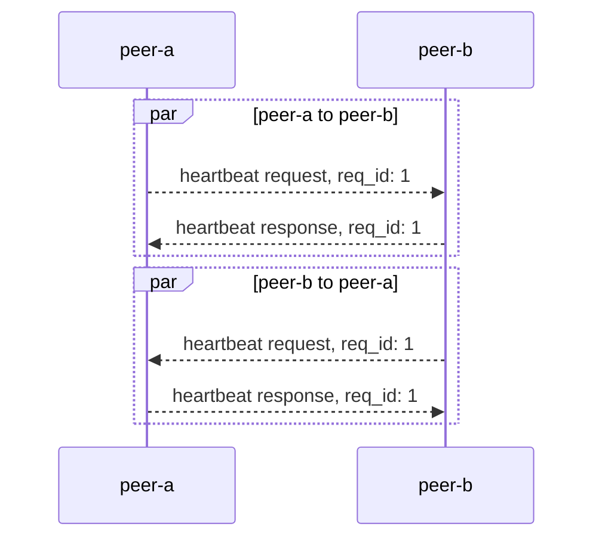
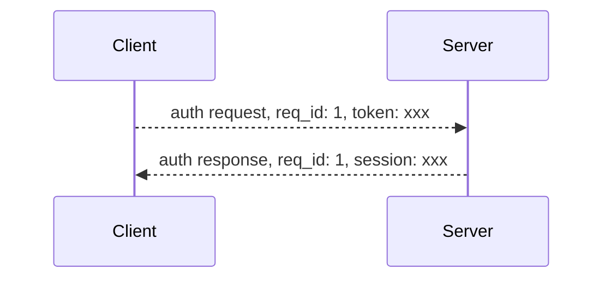

控制指令是基礎指令，主要用於建立鏈接，保持會話使用。

目前有 4 個控制指令：

| cmd_code | 說明                                                  |
| -------- | ----------------------------------------------------- |
| 0        | 關閉 - 服務端在關閉鏈接前會向客戶端推送關閉包         |
| 1        | 心跳 - 用於保持鏈接                                   |
| 2        | 鑑權 - 握手成功後，如果沒有 session，則需要鑑權       |
| 3        | 重連 - 鏈接斷開後，如果有 session，用於鏈接合法性鑑權 |

## 關閉

:::info
指令：`0`
:::

服務端主動關閉鏈接時，會向客戶端推送一個關閉包。

> 關閉包是推送類型，不需要回復

服務端主動關閉鏈接總共有一下幾種情況：

1. 心跳超時
2. 服務端發生錯誤
3. 服務端關閉
4. 客戶端發送數據解析失敗
5. 鑑權失敗
6. Session 過期
7. Session 重複建鏈

這些信息會放到 `body` 內發送，Protobuf 定義如下：

```protobuf
message Close {
 enum Code {
   HeartbeatTimeout  = 0; // 心跳超時
   ServerError       = 1; // 服務端錯誤
   ServerShutdown    = 2; // 服務端關閉
   UnpackError       = 3; // 數據截取錯誤
   AuthError         = 4; // 鑑權失敗
   SessExpired       = 5; // session 過期
   ConnectDuplicate  = 6; // 單個 session 重複連接
  }
  Code code = 1;
  string reason = 2;
}
```

## 心跳

:::info
指令：`1`
:::

一端可以通過向另一端發送心情請求，根據返回來判斷鏈接的健康狀態。心跳請求包沒有指定接口，一端收到心跳請求後，僅需將 `body` 原封不動的返回回去即可。

> 保持連接的同時，也可以用於檢測網絡延時：心跳請求時，可在發送包 `body` 添加本端當前時間戳；當收到心跳響應，解析 `body`，用當前時間戳減去解析出來的時間戳，就可以得出鏈路的延時



`body` 的例子：

```protobuf
message Heartbeat {
  int64 timestamp = 1;
}
```

## 登錄鑑權

:::info
指令：`2`
:::

登陸鑑權用於校驗連接的合法性，在握手建立連接以後發送的第一個包必須是登錄鑑權請求或者重連請求。



> 登錄鑑權的 `token` 通過 [REST 接口](./socket-otp-api.md) 獲取。

服務端在 token 校驗成功後會給客戶端返回一個 session，在 session 的有效期內，客戶端可以使用 session 進行重新鏈接，不需要再獲取 `token`。

請求和返回的定義如下：

```protobuf
message AuthRequest {
  string token = 1;
}

message AuthResponse {
  string session_id = 1;
  int64 expires = 2;
}
```

## 重連

:::info
指令：`3`
:::

重連是客戶端斷開鏈接後，通過 session 進行鑑權。和登錄鑑權相似的是，服務在校驗 session 過後會返回一個新的 session，下次客戶端重連時可以使用。

請求和返回定義如下：

```protobuf
message ReconnectRequest {
    string session_id = 1;
}

message ReconnectResponse {
  string session_id = 1;
  int64 expires = 2;
}
```

## Protobuf

所有控制指令相關的 `Protobuf` 都已經開源在 [GitHub](https://github.com/longportapp/openapi-protobufs/blob/main/control/control.proto)
