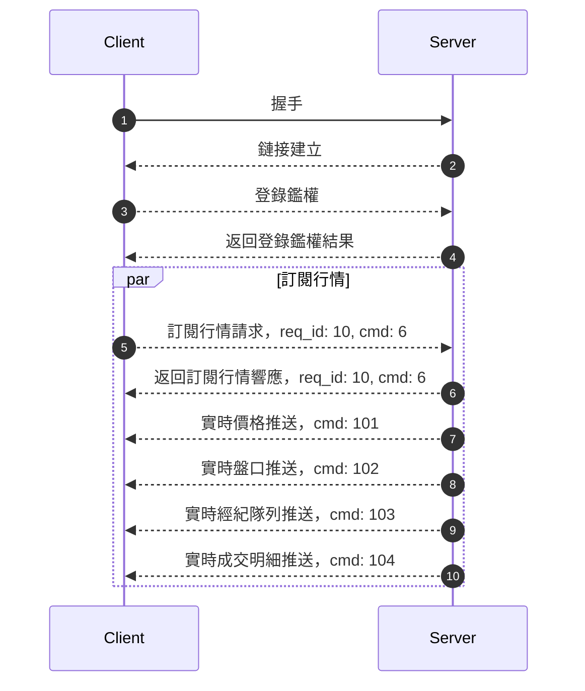

客戶端可以通過 WebSocket 或者 TCP 和行情網關建立長連接，客戶端訂閱股票行情，行情網關會實時推送客戶端訂閱的實時行情。

:::info
WebSocket Endpoint: `wss://openapi-quote.longbrdge.global`

TCP Endpoint: `openapi-quote.longbridge.global:2020`
:::

流程如下：



## 訂閱

客戶端在和服務端建立連接後需要通過訂閱行情的指令訂閱不同類型的行情。

訂閱的 Protobuf 定義可以[查看](../quote/subscribe/subscribe)

Example:

```json
{
  "symbol": ["700.HK", "AAPL.US"]
  "sub_type": [1, 2]
  "is_first_push": true
}

```

> 這裏方便展示使用 `JSON`，實際上需要通過 protobuf 序列化請求到服務端

客戶端也可以通過獲取已訂閱接口查看自己已經訂閱的標的行情，[Protobuf 定義](../quote/subscribe/subscription)

訂閱成功後，服務端會推送相應的標的行情到客戶端，具體的數據可以查看[行情概覽](../quote/overview)

## 其他接口

行情的數據拉去都是通過長連接網關的，具體可以查看[行情概覽](../quote/overview)

## 協議

想要訂閱行情，必須先了解我們的協議，我們使用的長連接[協議](./protocol/overview)
