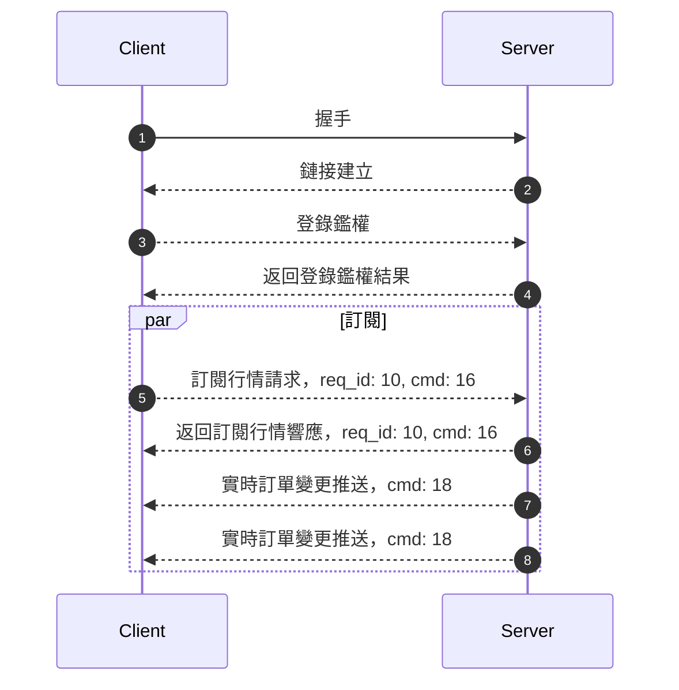

客戶端可以通過 WebSocket 或者 TCP 和交易推送網關建立長連接，當訂單狀態更新時，客戶端可以實時的接收通知。

:::info
WebSocket Endpoint: `wss://openapi-trade.longbridge.global`

TCP Endpoint: `openapi-trade.longbridge.global`
:::

流程如下：



## 訂閱

訂閱的 Protobuf 定義可以[查看](../quote/trade/trade-push)

Example:

```json
{
  "topics": ["private"]
}
```

> 這裏方便展示使用 `JSON`，實際上需要通過 protobuf 序列化請求到服務端

## 推送例子

```json
{
  "topic": "private",
  "content_type": 2,
  "dispatch_type": 1,
  "data": "eyJldmVudCI6Im9yZGVyX2NoYW5nZWRfbGIiLCJkYXRhIjp7InNpZGUiOiJCdXkiLCJzdG9ja19uYW1lIjoi6IW+6K6v5o6n6IKhIiwicXVhbnRpdHkiOiIxMDAwIiwic3ltYm9sIjoiNzAwLkhLIiwib3JkZXJfdHlwZSI6IkxPIiwicHJpY2UiOiIyMTMuMiIsImV4ZWN1dGVkX3F1YW50aXR5IjoiMTAwMCIsImV4ZWN1dGVkX3ByaWNlIjoiMjEzLjIiLCJvcmRlcl9pZCI6IjI3IiwiY3VycmVuY3kiOiJIS0QiLCJzdGF0dXMiOiJOZXdTdGF0dXMiLCJzdWJtaXR0ZWRfYXQiOiIxNTYyNzYxODkzIiwidXBkYXRlZF9hdCI6IjE1NjI3NjE4OTMiLCJ0cmlnZ2VyX3ByaWNlIjoiMjEzLjAiLCJtc2ciOiJJbnN1ZmZpY2llbnQgUXR5IC0gMTAwMCIsInRhZyI6IkdUQyIsInRyaWdnZXJfc3RhdHVzIjoiQUNUSVZFIiwidHJpZ2dlcl9hdCI6IjE1NjI3NjE4OTMiLCJ0YWlsaW5nX2Ftb3VudCI6IjUiLCJ0YWlsaW5nX3BlcmNlbnQiOiIxIiwibGltaXRfb2Zmc2V0IjoiMC4wMSIsImFjY291bnRfbm8iOiJISzEyMzQ0NSJ9fQ=="
}
```

:::info
`data` 是 `JSON` 字符串的二進制內容 (base64)
:::

`data` 的實際 `JSON` 內容如下

```json
{
  "event": "order_changed_lb",
  "data": {
    "side": "Buy",
    "stock_name": "騰訊控股",
    "quantity": "1000",
    "symbol": "700.HK",
    "order_type": "LO",
    "price": "213.2",
    "executed_quantity": "1000",
    "executed_price": "213.2",
    "order_id": "27",
    "currency": "HKD",
    "status": "NewStatus",
    "submitted_at": "1562761893",
    "updated_at": "1562761893",
    "trigger_price": "213.0",
    "msg": "Insufficient Qty - 1000",
    "tag": "GTC",
    "trigger_status": "ACTIVE",
    "trigger_at": "1562761893",
    "tailing_amount": "5",
    "tailing_percent": "1",
    "limit_offset": "0.01",
    "account_no": "HK123445"
  }
}
```

字段解釋可以查看[交易命名詞典-WebSocket 推送通知](../trade/trade-definition#websocket-推送通知)

## 協議

我們使用的長連接[協議](./protocol/overview)
